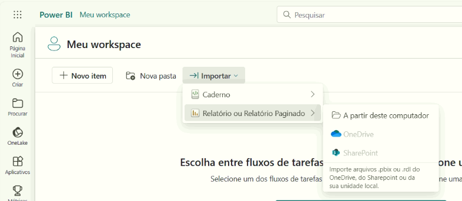
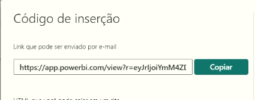

# 🛠️ Implementação

### Sobre o Relatório

- **Passo 1: Download**
    - Baixe o arquivo Bi Acadêmico **Bi_Eureca_Acadêmico.pbix** disponível no Google Drive através do link: [https://drive.google.com/drive/folders/1v9ZBgZYRFqdjfRr34LjIK-i_qqHy3IAR?usp=sharing](https://drive.google.com/drive/folders/1v9ZBgZYRFqdjfRr34LjIK-i_qqHy3IAR?usp=sharing).
    - Salve-o em uma pasta de fácil acesso no seu computador (ex.: C:\Relatórios\).
- **Passo 2: Importação no Power BI Service**:
    - Acesse [app.powerbi.com](https://app.powerbi.com/) em seu navegador.
    - Faça login com sua conta do Power BI Service.
    - No menu à esquerda, clique em **'Meu Workspace'**.
    - Clique em **'Importar'**
    - Escolha **'Relatório ou Relatório paginado'** e clique em 'A partir deste computador'.
    
    
    
    - Selecione o arquivo Bi Acadêmico **Bi_Eureca_Acadêmico.pbix** que você baixou e aguarde a importação.
    - Após o upload, o relatório aparecerá na lista do seu workspace.
- **Passo 3: Publicação na Web:**
    1. No Power BI Service, localize o relatório Bi Acadêmico UFCG no seu workspace.
    2. Clique no seu relatório para que ele abra.
    3. Clique em **'Arquivo'** no canto superior esquerdo.
    4. Depois clique em ‘**Inserir relatório**’ em seguida em ‘**Publicar na Web (publico)**’
        
       
        
    5. Copie o link público gerado (ex.: https://app.powerbi.com/view?r=abc123).
        
        
        
    6. Compartilhe o link com os usuários.
- **Passo 4 (caso necessário): Configuração de mapas**
Caso a visualização dos mapas dentro do relatório publicado esteja com problemas, é necessário ativar isso dentro das configurações:
    1. Dentro do seu relatório, clique em ‘**Configurações**’ no menu superior direito
    2. No tópico **Governança e insights** clique em ‘**Portal de administração**’
    3. em **Configurações de Locatário,** procure pelo tópico **Configurações de integração**
    4. em **Configurações de integração,** procure e habilite ‘**Mapa e visuais de mapa preenchidos**’

### Sobre o BackEnd

O código base do backend está disponível nesse repositório: 

[https://github.com/AndersonLLeite/backend-bi-ufcg](https://github.com/AndersonLLeite/backend-bi-ufcg)

Ele pode ser executado localmente, permitindo a sincronização e o tratamento dos dados, para que, em seguida, seja possível atualizar o relatório no Power BI por meio de requisições à API local. Alternativamente, o backend pode ser feito a implantação em um servidor, onde está configurado para realizar atualizações periódicas da base de dados, garantindo a manutenção e a consistência das informações de forma automatizada. 

### Pontos Importantes:

1. **Consumo da API do Eureca**
O backend utiliza os endpoints da API do Eureca, acessível em: https://eureca.sti.ufcg.edu.br/das/v2/. Se essa API for alterada, será necessário atualizar a URL base no arquivo application.properties com o novo endereço.
2. **Agendamento da Atualização de Dados**
O backend está configurado para atualizar sua base de dados uma vez por mês, conforme definido na classe SynchronizationService, no método synchronizeData(), com a anotação @Scheduled(cron = "0 0 0 1 * ?"). Para alterar essa periodicidade, basta modificar o valor da expressão cron nessa anotação.
3. **Atualização Manual**
Para forçar uma atualização manual, está disponível o endpoint "/synchronization/start". Esse endpoint inclui um controle básico de acesso baseado em senha, que deve ser fornecida na requisição. A senha padrão está definida no SynchronizationController e deve ser alterada antes da implantação  do sistema.
